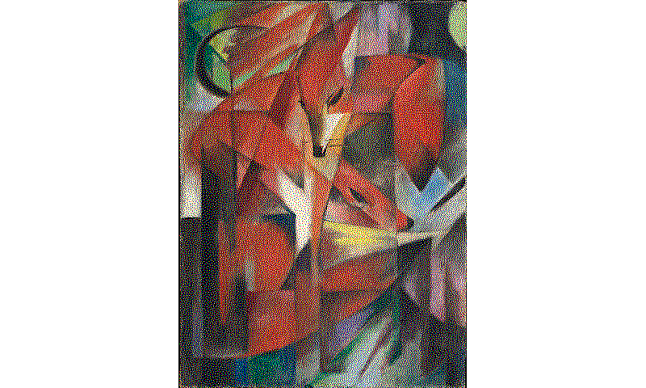

# How to make images for Waveshare 7.3inch E6 Full Color E-Paper using Image magick

Waveshare e-ink display can show only 6 colors: Black, White, Green, Blue, Red, Yellow, 
so you cannot use any image for it, but using Image magick you can convert any image to use with this display.

Display homepage:

[https://www.waveshare.com/rpi-zero-photopainter-acce.htm](https://www.waveshare.com/rpi-zero-photopainter-acce.htm)


Display wiki:

[https://www.waveshare.com/wiki/RPi_Zero_PhotoPainter](https://www.waveshare.com/wiki/RPi_Zero_PhotoPainter)


# 1. Install Image magick

[https://imagemagick.org/](https://imagemagick.org/)

on MacOS

``
brew install imagemagick
``

# 2. Now you can convert one image or all at once

## 2.1. Convert one image

To convert `pic.jpeg` to `pic.bmp` use this command:

```
magick pic.jpeg         \
-resize 800x480         \
-background white       \
-gravity center         \
-extent 800x480         \
-dither FloydSteinberg  \
-remap colortable-2.gif \
pic.bmp
```

`magick` - main command

`pic.jpeg` - image to convert

`-resize 800x480` - resize image to 800 pixels width and 480 pixels height, original aspect ratio is maintained

`-background white` - if image is smaller then fill background with white

`-gravity center -extent 800x480` - this centers the original image inside a new white 800 × 480 pixel canvas

`-dither FloydSteinberg` - make Floyd-Steinberg dithering

`-remap colortable-2.gif` - use colors from this file. It is compulsory.

Download colortable-2.gif here: [colortable-2](colortable-2.gif)


`pic.bmp` - resulting image

## 2.2. Convert all images in folder

Convert all images in `image_folder` using this command:

```
cd image_folder

magick mogrify          \
-resize 800x480         \
-background white       \
-gravity center         \
-extent 800x480         \
-dither FloydSteinberg  \
-remap colortable-2.gif \
-path image_folder      \
-format bmp             \
*.jpg *.jpeg *.png *.webp
```
parameters:

`mogrify` - mogrify is a powerful command-line utility within the ImageMagick suite used for batch processing and modifying images. Unlike the standard magick or legacy convert commands, mogrify overwrites the original files by default. It is highly efficient for editing entire directories of images simultaneously using wildcards.

Download colortable-2.gif here: [colortable-2](colortable-2.gif)

`-format bmp` - convert to .bmp format

`*.jpg *.jpeg *.png *.webp` - convert from these file formats

other parameters are the same as in previous section


## Fox Samples

[https://en.wikipedia.org/wiki/The_Foxes_(Marc)](https://en.wikipedia.org/wiki/The_Foxes_(Marc))

Original image:


</br>

You can use two different dithering methods - Floyd-Steinberg and Riemersma

Try yourself and select wich is better:

### For Floyd-Steinberg Dither
```
magick foxes.jpg        \
-resize 800x480         \
-background white       \
-gravity center         \
-extent 800x480         \
-dither FloydSteinberg  \
-remap colortable-2.gif \
foxes_FloydSteinberg.bmp
```
Floyd-Steinberg:


</br>


### For Riemersma Dither
```
magick foxes.jpg        \
-resize 800x480         \
-background white       \
-gravity center         \
-extent 800x480         \
-dither Riemersma       \
-remap colortable-2.gif \
foxes_Riemersma.bmp
```
Riemersma:


</br>
